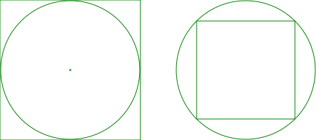

# Շրջանագիծ և քառակուսի

Տրված է շրջանը՝ բնութագրված իր շառավղով, և տրված է քառակուսին՝ բնութագրված իր կողմի երկարությամբ։ Պահանջվում է պարզել, թե կարո՞ղ է արդյոք շրջանը տեղավորվել քառակուսու մեջ, կամ՝ քառակուսին շրջանի։

Օգտագործողը պետք է ներմուծի շրջանի շառավղի ու քառակուսու կողմի երկարությունները, իսկ ծրագիրը պետք է արտածի կա՛մ «radius շառավղով շրջանը տեղավորվում է side կողմով քառակուսու մեջ», կա՛մ «side կողմով քառակուսին տեղավորվում է radius շառավղով շրջանի մեջ»։

Նախ կազմակերպենք տվյալների ներմուծումը՝ նախորդ օրինակում օգտագործված կաղապարի նմանությամբ։ Այսպես.

```C++
std::cout << "Շրջանագծի շառավիղը. ";
double radius = 0.0;
std::cin >> radius;

std::cout << "Քառակուսու կողմը. ";
double side = 0.0;
std::cin >> side;
```

Որպեսզի շրջանը տեղավորվի քառակուսու մեջ անհրաժեշտ է, որ դրա տրամագիծը փոքր կամ հավասար լինի քառակուսու կողմից։ Այլ կերպ ասած՝ «radius շառավղով շրջանը տեղավորվում է side կողմով քառակուսու մեջ» տեքստը պետք է արտածվի միայն ա՛յն դեպքում, _եթե_ ճշմարիտ է `2 * radius <= side` պայմանը: Այս «եթե»-ն C++ լեզվում արտահայտվում է `if` ղեկավարող կառուցվածքով։ Այսպես.

```C++
if( 2 * radius <= side )
  std::cout << radius << " շառավղով շրջանը տեղավորվում է "
            << side << " կողմով քառակուսու մեջ" << std::endl;
```

Հաջորդը. որպեսզի քառակուսին տեղավորվի շրջանի մեջ, ապա անհրաժեշտ է, որ դրա անկյունագծի երկարությունը փոքր կամ հավասար լինի շրջանի տրամագծից։ Պարզեցված տեսքով՝ `side² ≤ 2 * radius²`։

```C++
if( side * side <= 2 * radius * radius )
  std::cout << side << " կողմով քառակուսին տեղավորվում է "
            << radius << " շառավղով շրջանի մեջ" << std::endl;
```



Ակնհայտ է, որ վերը նշված պայմաններն իրար բացառող են։ Այսինքն՝ եթե առաջին պայմանը ճշմարիտ է, ապա երբեք երկրորդը չի կարող ճշմերիտ լինել և այն ստուգելն իմաստ չունի։ `if` կառուցվածքը հնարավորություն է տալիս `else` բառով սահմանել այլընտրանքի ճյուղ։ Այսպես, եթե ծրագում գրառված է հրամանների հետևյալ հաջորդականությունը.

```C++
S₀;
if( P₁ )
  S₁;
if( P₂ )
  S₂;
S₃;
```
