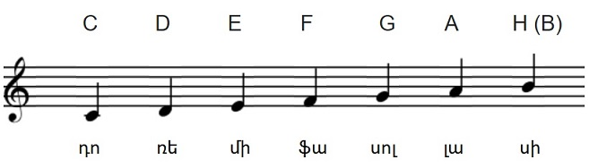

# Նոտաների գրառում

Երաժշտական նոտաները՝ _դո_, _ռե_, _մի_, _ֆա_, _սոլ_, _լա_ և _սի_, ընդունված է գրառել լատինական այբուբենի առաջին յոթ տառերով, համապատասխանաբար՝ _C_, _D_, _E_, _F_, _G_, _A_ և _B_ (կամ _H_)։



Գրենք ծրագիր, որն օգտագործողին առաջարկում է ներմուծել նոտաների անգլիական (կամ գերմանական) գրառման տառը և արտածում է դրան համապատասխան նոտայի անունը։ Օրինակ.

```
$ ./musicalnotes
Ներմուծեք տառը. C
C տառով նշանակվում է «դո» նոտան։
```

Նոտայի նշանակման տառի համար սահմանենք `char` (character, նիշ) տիպի `note` փոփոխականը, և `cin`-ից կարդանք դրա արժեքը։

```C++
cout << "Ներմուծեք տառը. ";
char note = '\0';
cin >> note;
```

Արդեն գիտենք, որ այս տիպի խնդիրները կարելի է ծրագրավորել `if`-`else`-ների հաջորդականությամբ (տես՝ «[Շրջանագիծ և քառակուսի](circleandsquar.md)» ծրագիրը)։ Այսպես.

```C++
if ('C' == note)
    cout << note << " տառով նշանակվում է «դո» նոտան։" << endl;
else if ('D' == note)
    cout << note << " տառով նշանակվում է «ռե» նոտան։" << endl;
else if ('E' == note)
    cout << note << " տառով նշանակվում է «մի» նոտան։" endl;
else if ('F' == note)
    cout << note << " տառով նշանակվում է «ֆա» նոտան։" endl;
else if ('G' == note)
    cout << note << " տառով նշանակվում է «սոլ» նոտան։" endl;
else if ('A' == note)
    cout << note << " տառով նշանակվում է «լա» նոտան։" endl;
else if ('B' == note || 'H' == note)
    cout << note << " տառով նշանակվում է «սի» նոտան։" endl;
else
  cout << note << " տառով որևէ նոտա չի նշանակվում։" endl;
```
